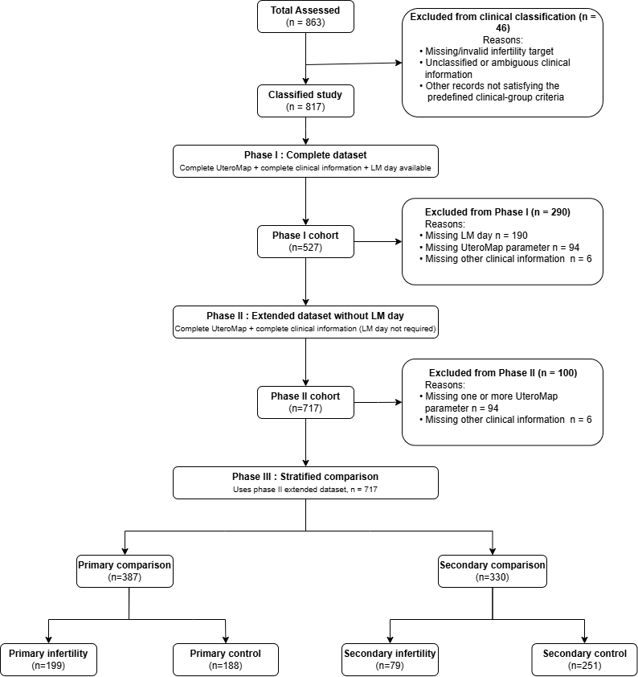

# UteroMap: Uterine Morphometric Analysis & Machine Learning Benchmarks

This repository contains the complete Python source code and analysis scripts accompanying the research study: **"Uterine Morphometric Analysis Using the UteroMap Standardized Ultrasound Technique and Machine Learning Models in the Assessment of Female Infertility"**. 

## Citation Requirements

If you use the dataset or code provided in this repository, please cite the official OSF data repository and publication:

> Alburai, K., Kovács, K., Török, P., & Harangi, B. (2026). *Uterine Morphometric Analysis Using the Uteromap Standardized Ultrasound Technique and Machine Learning Models in the Assessment of Female Infertility*. OSF. [doi:10.17605/OSF.IO/8M2D4](https://doi.org/10.17605/OSF.IO/8M2D4)

---

## Study Overview & Analytical Workflow

The repository is structured around a multi-phase machine learning and data validation pipeline designed to test the analytical utility of standardized uterine morphometry (acquired via the **UteroMap** transvaginal ultrasound protocol) in assessing female infertility. 

## Cohort Selection Flowchart




## Repository Structure & File Descriptions

```text
├── Code/
│   ├── Cohort Verification.py             # Data verification, cleaning, and cohort flowchart generator
│   ├── Phase 1.py                         # ML pipeline for Phase I complete dataset with LMP (n = 527)
│   ├── Phase 2.py                         # ML pipeline for Phase II extended dataset without LMP (n = 717)
│   └── Phase 3.py                         # ML pipeline for Phase III stratified subgroup analysis (n = 717)
├── requirements.txt                       # Python dependencies
└── README.md                              # Project documentation
